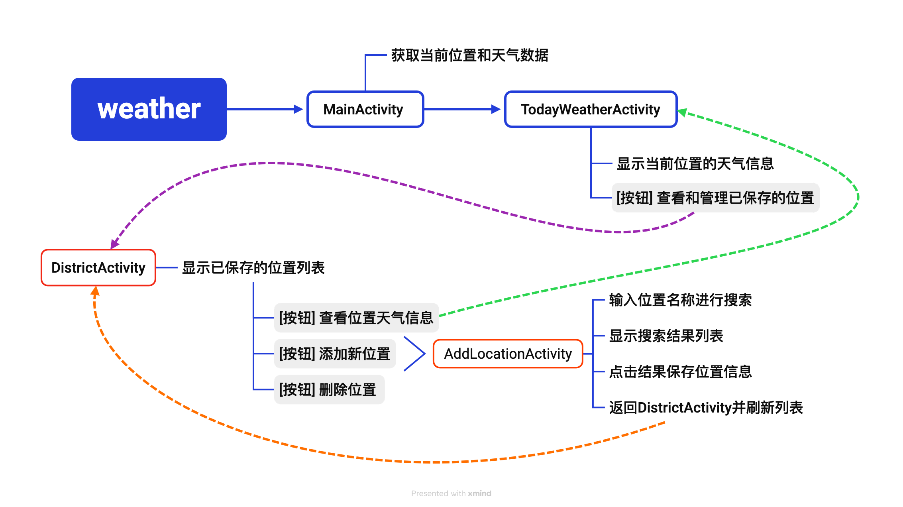
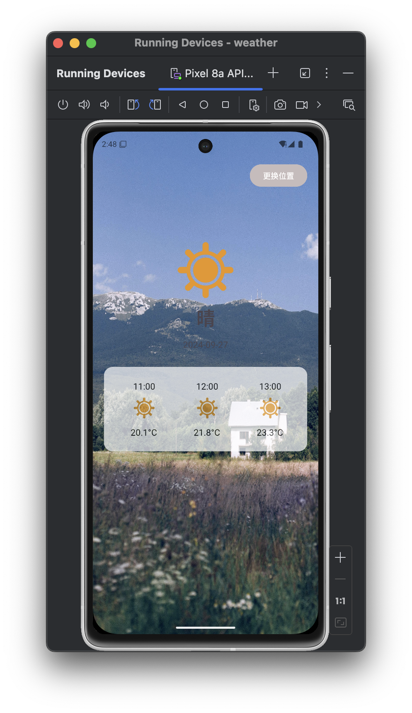

这是一个安卓移动开发大作业项目，名为 **WeatherApp**。该应用使用高德API进行位置搜索，并通过彩云天气API获取天气数据。用户可以管理和查看多个地点的天气信息，包括显示当前位置的天气。


### 功能介绍

**定位与位置搜索**：使用高德API定位用户当前位置，用户可以通过搜索框输入地点名称进行位置搜索，并从结果中选择地点。

**天气数据获取**：通过彩云天气API获取指定地点的实时天气和未来24小时的天气预报。

**地点管理**：用户可以将搜索到的地点添加到地点列表，支持删除已添加的地点，并带有删除确认对话框。

**天气显示**：显示选中地点的实时天气信息，包括天气图标和体感温度，显示未来24小时的天气预报，包括天气图标和体感温度。项目结构


### 项目结构

```
- src
  - com.example.weather
    - AddLocationActivity.java
    - DistrictActivity.java
    - Location.java
    - LocationAdapter.java
    - LocationDatabaseHelper.java
    - MainActivity.java
    - SearchResultAdapter.java
    - TodayWeatherActivity.java
    - WeatherAdapter.java
    - WeatherReferenceTable.java
- res
  - layout
    - activity_add_location.xml
    - acticity_district.xml
    - activity_main.xml
    - activity_today_weather.xml
    - district.xml
    - item_hourly_weather.xml
  - values
    - strings.xml
  - drawable
    - 各种天气图标资源
- AndroidManifest.xml
```



### 安装和运行

1. 克隆仓库：
   ```bash
   git clone https://github.com/your_username/weather_app.git
   cd weather_app
   ```

2. 在Android Studio中打开项目。

3. 配置项目所需的API Key：
   - 高德API Key: 在`MainActivity.java`中配置高德API Key。
   - 彩云天气API Key: 在`fetchWeatherData`方法中配置彩云天气API Key。

4. 运行应用。

### 主要功能

#### 1. 显示当前位置的天气信息

`MainActivity.java` 是应用的入口，启动时会获取当前位置的经纬度，并使用彩云天气API获取天气信息进行显示。

#### 2. 管理和显示多个位置的天气信息

`DistrictActivity.java` 用于显示和管理多个位置的天气信息。用户可以添加、删除位置，并查看不同位置的天气信息。

#### 3. 搜索并添加新的位置

`AddLocationActivity.java` 提供位置搜索功能，用户可以输入地址进行搜索，选择结果后添加到位置列表中。

### 类图

```plaintext
+-------------------------+
|      MainActivity       |
+-------------------------+
| - dbHelper: LocationDatabaseHelper |
| - weatherData: String   |
| - latitude: double      |
| - longitude: double     |
| - city: String          |
| - district: String      |
| + fetchWeatherData()    |
+-------------------------+
            |
            V
+-------------------------+
|  DistrictActivity       |
+-------------------------+
| - dbHelper: LocationDatabaseHelper |
| - locationList: List<Location> |
| + readAndDisplayLocations() |
| + fetchWeatherData()    |
+-------------------------+
            |
            V
+-------------------------+
| AddLocationActivity     |
+-------------------------+
| - dbHelper: LocationDatabaseHelper |
| - searchResults: List<GeocodeAddress> |
| + searchLocation()      |
| + saveLocationAndReturn() |
+-------------------------+
            |
            V
+-------------------------+
|    TodayWeatherActivity |
+-------------------------+
| - weatherData: String   |
| + fetchWeatherData()    |
+-------------------------+
```

### 流程图

```plaintext
[用户启动应用]
        |
        V
[MainActivity 启动]
        |
        V
[获取当前位置经纬度]
        |
        V
[调用彩云天气API获取天气信息]
        |
        V
[显示天气信息]
        |
        V
[用户点击"管理位置"按钮]
        |
        V
[启动DistrictActivity]
        |
        V
[从数据库读取位置列表]
        |
        V
[显示位置列表]
        |
        +--------------------------+
        |                          |
        V                          V
[用户点击位置项]          [用户点击"添加位置"按钮]
        |                          |
        V                          V
[启动TodayWeatherActivity]   [启动AddLocationActivity]
        |                          |
        V                          V
[调用彩云天气API获取天气信息]   [用户输入地址并搜索]
        |                          |
        V                          V
[显示天气信息]              [显示搜索结果]
                                  |
                                  V
                       [用户选择搜索结果]
                                  |
                                  V
                       [保存位置到数据库]
                                  |
                                  V
                       [返回DistrictActivity并刷新位置列表]
```

### 彩云天气API使用

彩云天气API用于获取天气数据。请求URL格式如下：

```url
https://api.caiyunapp.com/v2.6/{API_KEY}/{longitude},{latitude}/weather?dailysteps=3&hourlysteps=48
```

### 页面



### 贡献

欢迎贡献代码或提出建议，请通过GitHub的pull request或issue功能与我们联系。


# weather
